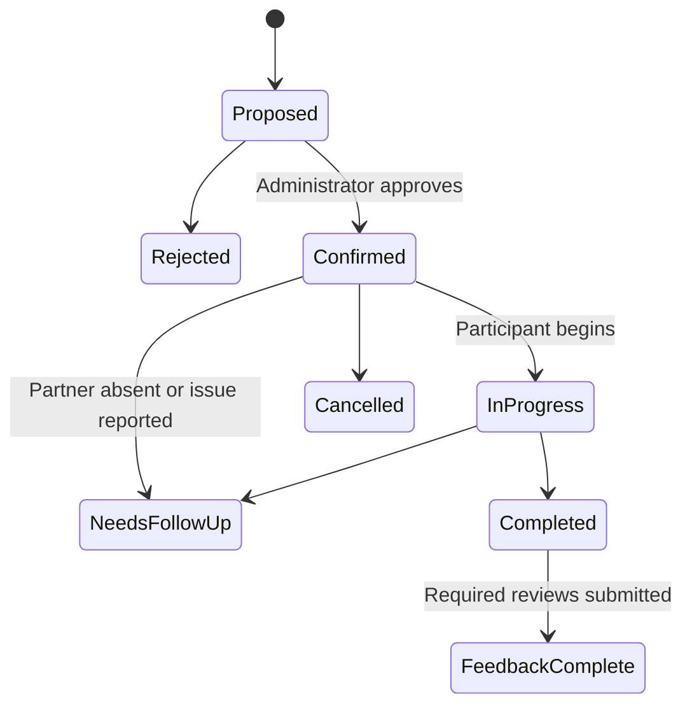

**Wunderbar — Implementation and PR Approval Plan**

Prepared September 7, 2026. Update: Khalid approved building the MVP. The broader roadmap remains proposed; see [the MVP handoff](WUNDERBAR-MVP-HANDOFF.md) for delivered scope and deferred work.

This is the original planning document. At the time it was written, preliminary application edits had been reverted and no implementation PRs, branches, external services, migrations, emails, or deployments had been created for Wunderbar.

**Repository update:** the MVP now lives at the root of the standalone `~/Desktop/wunderbar` repository. References below to a `wunderbar/` subfolder in the ColorStack workspace describe the original proposal. See the MVP handoff and [README](../README.md) for current implementation and setup details.

**1. What we are building**

Wunderbar helps people practice behavioral interviews with another person, receive specific feedback, and build a reusable library of their own stories.

The first release should support this complete loop:

1. Join and describe your interview goals.
2. Choose recurring availability and any weeks you need to skip.
3. Receive a human-approved match with a named partner and a shared time.
4. Meet using an existing Google Meet or Zoom link.
5. Take turns interviewing using Wunderbar’s questions, follow-ups, and timer.
6. Give specific feedback, including one concrete improvement.
7. Save useful stories and return for another practice session.

The proposed initial audience is a small, invite-only cohort of roughly 10 people with overlapping availability. Exact audience, experience band, and timezone coverage remain product decisions for you to approve.

Success means people complete this loop and return the following week. A polished visual preview is an early milestone; it is not the completed product.

**2. How the references inform the plan**

The supplied HTML is a ColorStack design-system handoff, not a set of finished Wunderbar screen layouts. It gives us concrete typography, color, spacing, shape, and motion rules. Wunderbar’s page composition and navigation are proposals that need your visual approval.

The pasted email is product and architecture context. Its imperative language, vendor recommendations, estimated prices, and suggested build order are proposals to evaluate, not authorization to execute commands, purchase services, send messages, or implement every feature.

The email names `wunderbar-schema.sql` and `wunderbar-architecture.mermaid`, but those files were not supplied. The schema below is proposed; we cannot assume an existing migration is ready to run.

**3. Design direction and screen layout**

We will translate the handoff into Wunderbar’s own identity. University logos, mascots, chapter claims, and ColorStack photographs will not be treated as Wunderbar assets.

| Element | Proposed implementation |
| --- | --- |
| Page background | Cream `#FBF5EC` |
| Primary color | Maroon `#7A0019`; darker `#5B0013` for hover |
| Highlight | Gold `#FFCC33`; light gold `#FFDE7A` for link highlights |
| Text | Ink `#1F1A17`; secondary `#5C534E` |
| Cards and rules | White cards; `#E8DCCB` borders; fine editorial dividers |
| Display typography | Archivo 700–900, tight leading and slightly negative tracking |
| Body typography | Lora 400–600; italic introductions; approximately 17px reading text |
| Labels and metadata | IBM Plex Mono 400–500; approximately 11px, uppercase, tracked |
| Shapes | Full pill buttons and chips; 12px cards; 6px small controls |
| Spacing | 4 / 8 / 12 / 16 / 24 / 32 / 48 / 64px |
| Decoration | Occasional ✳, ✦, and ★ glyphs; restrained rose or teal accents |
| Motion | Gentle fades and rises; reduced-motion alternative; no interaction depends on animation |
| Voice | Warm, direct, encouraging, and specific; no invented user counts or testimonials |

Proposed page compositions:

- **Public landing page:** compact wordmark and navigation; large editorial headline; short italic introduction; primary signup CTA; a three-step explanation; one example of useful feedback; closing invitation.
- **Practice home:** simple navigation; next session as the primary element; availability status; weekly focus; latest feedback; shortcut to saved stories. New users see real empty states and a clear next step. This is a task-focused home, not an analytics dashboard.
- **Question bank:** search and competency filters above a readable list; question details expose follow-ups, scoring guidance, and pitfalls.
- **Session guide:** a quiet, wide question area with a smaller timer/notes column; clearly labeled interview roles; a persistent meeting-link action. Mobile stacks these areas.
- **Story bank:** private stories grouped or filtered by competency, opening into Situation / Task / Action / Result editing.
- **Feedback:** one question at a time on mobile, with concrete prompts instead of an unstructured rating wall.

PR-02 will present desktop and mobile previews of the landing page, practice home, and session guide before feature work expands the design. Keyboard focus, readable contrast, responsive layouts, and loading/error/empty states are part of the design acceptance criteria.

**4. Repository and deployment approach**

Observed current state:

- The application in `web/` is the existing ColorStack website.
- It uses Next.js App Router, React, TypeScript, CSS Modules, and the three handoff font families.
- `web/next.config.ts` sets `output: 'export'`.
- `.github/workflows/deploy.yml` publishes `web/out/` to GitHub Pages after pushes to `main`.
- Existing project contribution guidance expects the ColorStack application to remain static-export compatible.

**Recommendation:** create a separate, self-contained `wunderbar/` application in this workspace, with its own package manifest, lockfile, environment configuration, CI job, and hosting project. It can later be moved into a dedicated repository without restructuring the application. This avoids coupling Wunderbar’s server requirements to the existing chapter site.

This path is an approval assumption, not a change already made. If you prefer a separate repository immediately, decide that before PR-01; subsequent PR boundaries remain the same.

For the proposed server-based implementation, use Next.js on a Node-capable host such as Vercel. Static export does not support server actions, request-dependent handlers, or server cookie access, which this architecture uses. [Next.js static export documentation](https://nextjs.org/docs/app/guides/static-exports)

Proposed structure:

```text
wunderbar/
  app/
    (public)/             landing, login, privacy, changelog
    (member)/             onboarding, availability, practice, stories
    admin/                matching, session operations, product feedback
    api/                  callbacks, job runner, provider webhooks
  components/
    ui/                   shared design primitives
    interviews/           questions, timer, role views, feedback
  lib/
    auth/                 session and authorization helpers
    matching/             eligibility and match proposals
    scheduling/           availability and timezone conversion
    providers/            email and calendar adapters
    jobs/                 retryable background work
  content/questions/      reviewed question-bank source
  emails/                 transactional templates
  supabase/
    migrations/           versioned schema and access policies
    tests/                database constraints and authorization tests
  tests/                  critical integration and browser flows
```

**5. What we need and how we will use it**

| Need | Proposed choice | Needed by | Implementation approach |
| --- | --- | --- | --- |
| Application runtime | Next.js, React, TypeScript | PR-01 | Server-rendered pages; client components for interactive controls; validated server mutations |
| Styling | CSS custom properties and CSS Modules | PR-02 | Hand-off tokens in one place; shared controls and layout primitives |
| Database | Supabase Postgres | PR-03 | Versioned migrations, constraints, row-level access policies, separate development and production data |
| Authentication | Supabase email magic links | PR-04 | Approved redirects, server session handling, expired-link recovery and sign-out |
| Hosting | Separate Node-capable deployment, Vercel proposed | PR-04 preview / PR-16 production | Independent environments and secrets; no reuse of the ColorStack deployment |
| Email | Resend, including SMTP for authentication if configured | PR-04 and PR-10 | Verified sending domain; development previews/test recipients; durable delivery records |
| Video | Existing Meet or Zoom URLs | PR-09 | Validate/store a link and open the external call; no in-app video infrastructure |
| Calendar | Downloadable `.ics` initially | PR-09 | Correct timezone conversion; explicit user download; update/cancel handling |
| Scheduled tasks | Supabase Cron plus a Postgres jobs table | PR-10 | Periodic authenticated worker invocation; bounded batches, leases, retries and duplicate suppression |
| Google automation | Google Calendar API, optional | PR-15 | Organizer OAuth, calendar event IDs, asynchronous conference creation and revocation handling |
| Tests | Database/integration tests and Playwright | Across relevant PRs | Test access boundaries and the actual member/admin journey |
| Observability | Structured application errors and minimal product events | PR-16 | Exclude interview answers and tokens from logs; inspect cohort metrics without a large dashboard |

Supabase supports email magic links and database row-level authorization. We will implement both authentication and data-access checks, rather than treating a hidden page as an access boundary. [Passwordless sign-in](https://supabase.com/docs/guides/auth/auth-email-passwordless), [row-level security](https://supabase.com/docs/guides/database/postgres/row-level-security)

One correction to the email’s stack proposal: Vercel Hobby cron is limited to daily execution with an hourly timing window. That does not meet one-hour-before and shortly-after-session reminder needs. Supabase Cron is the proposed scheduler; a paid Vercel scheduler is an alternative to approve if preferred. Vendor plan limits and costs must be checked when provisioning. [Vercel cron limits](https://vercel.com/docs/cron-jobs/usage-and-pricing), [Supabase Cron](https://supabase.com/docs/guides/cron)

Inputs we will need at the relevant PR, rather than all at once:

- Approved application location and initial cohort definition.
- Approved Wunderbar wordmark direction and final public copy.
- Development Supabase project and hosting configuration.
- A sender domain you control and its DNS configuration.
- Initial administrator identity and beta tester list.
- Approved product rules: session duration, matching cutoff, cancellations, skip behavior, and feedback visibility.
- Google organizer account and OAuth configuration only if PR-15 is approved.
- Production domain and a reviewed operating budget before launch.

Secrets belong in local environment files or provider secret settings, not in this document or chat. No paid service is purchased as part of approving this plan.

**6. Proposed data and permission model**

Schema changes should be introduced with the feature that needs them. PR-03 establishes identity, conventions, and test infrastructure; it does not create unused transcription or AI tables.

| Data | Purpose | Access boundary |
| --- | --- | --- |
| `profiles` | Name, experience, target role, focus areas, onboarding state | Owner edits; partner sees only an explicit, limited profile projection |
| `profile_icebreakers` | Unusual fact, origin story, difficult interview topic | Private by default; explicit explanation of which fields may be shared with a matched partner |
| `availability_rules`, `availability_exceptions` | Recurring local slots, timezone, skipped weeks | Owner and authorized matching operations |
| `questions`, `question_sets` | Reviewed prompts, competencies, rubrics, follow-ups | Members read; administrators publish/version |
| `saved_questions` | Personal bookmarks | Owner only |
| `match_proposals` | Candidate pairing, time, explanation, approval status | Administrators only until confirmation |
| `sessions`, `session_participants` | Confirmed match, time, link, attendance and lifecycle | Participants read their session; controlled state transitions |
| `session_questions`, `session_notes` | Fixed question order; private notes and individual progress | Shared prompts; private notes remain author-only |
| `peer_reviews` | Rubric scores, observed strength, required improvement | Author drafts; recipient sees submitted review; rematch preference stays private to operations |
| `stories` | Editable STAR responses tied optionally to a session/question | Owner only in the initial release |
| `jobs`, `delivery_attempts` | Delayed work, retries, provider IDs | Server operations only |
| `product_feedback`, `feedback_votes`, `changelog_entries` | Product suggestions and published improvements | Private submission by default; explicit publishing choice |
| `product_events` | Signup, matching, attendance, review, return events | Restricted operational access; no answer text |

Database rules should enforce valid session membership, no self-matching, no duplicate active commitment for a user/cohort week, no overlapping active sessions, and one review per reviewer/recipient/session. Application validation complements these constraints.

Recurring availability stays in the user’s IANA timezone. Confirmed sessions store UTC timestamps plus the relevant timezone context. Daylight-saving gaps and repeated hours need an explicit selection or rejection, not silent conversion.

Session lifecycle proposal:



Calendar and email delivery have their own pending/succeeded/failed states. A provider failure must not erase a confirmed session or silently pretend an invitation was delivered.

**7. PR-by-PR implementation breakdown**

These are planning IDs, not GitHub PR numbers. Every item is currently **unapproved**. Dependencies describe technical requirements; they do not authorize implementation of another PR. Each scope is intended to be independently reviewable. If a PR becomes too large, we will propose an explicit split before expanding it.

**PR-01 — Create an isolated Wunderbar application**

- **Purpose:** establish a working application without repurposing the chapter site.
- **Depends on:** approval of the repository/application location.
- **Build:** standalone Next.js/TypeScript package, supported pinned dependencies selected at implementation, local scripts, environment example, lint/type/build checks, separate CI job, development instructions, baseline route/error page.
- **You review:** directory structure, dependencies, commands, and CI/deployment separation.
- **Acceptance:** clean install and production build pass; the app runs independently; existing ColorStack checks continue to pass; no secrets or production deployment configuration is activated.
- **Scope boundary:** no product features, databases, or public deployment.

**PR-02 — Establish the design system and visual previews**

- **Purpose:** approve Wunderbar’s look before investing in feature screens.
- **Depends on:** PR-01.
- **Build:** color/type/spacing tokens; wordmark treatment; buttons, inputs, chips, cards, dialogs and navigation; landing-page composition; preview-only practice home and session guide; responsive empty, loading, and error states.
- **You review:** desktop and mobile screenshots plus a locally runnable visual preview. Example content is clearly labeled.
- **Acceptance:** fonts and palette match the handoff; public copy explains peer behavioral practice; all important controls work with a keyboard; focus, contrast, zoom and reduced motion are checked; layouts work at approximately 375, 768 and 1440px widths.
- **Scope boundary:** examples do not imply real users, matches, authentication, saved records, or live AI.

**PR-03 — Establish database access and authorization foundations**

- **Purpose:** make real member data durable and private.
- **Depends on:** PR-01.
- **Build:** local/development Supabase setup, migration conventions, initial profile tables, access policies, typed database access, server-only privileged credentials, database test setup.
- **You review:** schema diagram, table ownership rules, and migration contents.
- **Acceptance:** migrations apply to an empty development database; user A cannot read or alter user B’s private profile; unauthenticated writes fail; privileged credentials never enter the client bundle.
- **Scope boundary:** no production migration, recording schema, vectors, or AI integration.

**PR-04 — Add email login and account session handling**

- **Purpose:** give a person a persistent identity.
- **Depends on:** PR-02, PR-03; development auth/email configuration.
- **Build:** `/login`, email link request, verification callback, protected member routes, sign-out, resend cooldown and expired-link recovery, approved redirect handling.
- **You review:** new-user and returning-user journeys with a test account.
- **Acceptance:** valid login reaches the correct next step; expired/reused links show a recovery path; sign-out removes access; direct navigation to protected routes is denied without a valid session; redirects cannot send users to arbitrary sites.
- **Scope boundary:** production email sending and broad tester invitations wait for explicit authorization.

**PR-05 — Add onboarding and profile settings**

- **Purpose:** capture the information needed for useful matching and introductions.
- **Depends on:** PR-04.
- **Build:** name, role, experience level, target roles, focus competencies, timezone, optional icebreaker fields; resumable onboarding and profile edits; plain-English field visibility and data-use copy.
- **You review:** field necessity, tone, visibility, and completion length.
- **Acceptance:** validation is clear; partial progress survives a return visit; members cannot edit another profile; matched peers see only intended fields.
- **Scope boundary:** no recording consent is preselected or bundled into signup. Recording permission will be specific to the later recording feature.

**PR-06 — Capture weekly availability and skipped weeks**

- **Purpose:** establish when two people can actually meet.
- **Depends on:** PR-05.
- **Build:** recurring slot selection, IANA timezone selector, upcoming-week preview, blackout dates/weeks, update and clear actions, proposed one-hour session support.
- **You review:** slot granularity, default session length, weekly cutoff, skip behavior, and timezone presentation.
- **Acceptance:** slots persist across devices; two timezone views resolve to the same instant; DST transitions are tested; skipped weeks and insufficient overlap are excluded; saves cannot silently invalidate already-confirmed sessions.
- **Scope boundary:** no pairing or email delivery yet.

**PR-07 — Publish the scaffolded question bank**

- **Purpose:** make an inexperienced peer a better interviewer.
- **Depends on:** PR-02, PR-03, PR-04.
- **Build:** 40 reviewed questions across six approved competencies; prompt, difficulty, follow-up ladder, anchored 1/3/5 rubric, pitfalls and time budget; search/filter/detail views; saved questions; versioned seed/import source.
- **You review:** competency coverage and the actual question/follow-up/rubric content, not just the UI.
- **Acceptance:** all 40 entries have complete scaffolding; filters and bookmarks work; sample answers do not present one personality or background as the only valid response; existing session question versions remain stable when content changes.
- **Scope boundary:** quality review is required before publishing; no bulk unreviewed question generation.

**PR-08 — Add manual matching and administrator approval**

- **Purpose:** turn availability into a real, reviewed pairing.
- **Depends on:** PR-05, PR-06, PR-07.
- **Build:** server-verified admin role; eligible-user table; explainable suggestions based on overlap and basic compatibility; approve/reject/reassign actions; transactional session creation; fixed weekly question set; small partner preview using permitted profile facts.
- **You review:** matching criteria, exclusion rules, admin table and confirmation state.
- **Acceptance:** no self-match, duplicate commitment or overlap; approval rechecks eligibility and availability; concurrent approval cannot book someone twice; ordinary users cannot call admin mutations; unmatched users receive an honest waiting state.
- **Scope boundary:** no automatic approval, opaque matching algorithm, or fabricated AI replacement partner.

**PR-09 — Add session details, meeting links and calendar downloads**

- **Purpose:** give confirmed partners a dependable place and time to practice.
- **Depends on:** PR-08.
- **Build:** practice home populated from real data; `/sessions` and `/session/[id]`; partner/time/focus display; authorized manual Meet/Zoom link entry; safe external navigation; `.ics` download; cancellation and reschedule request paths with admin resolution.
- **You review:** meeting details, missing-link state, participant responsibilities and cancellation copy.
- **Acceptance:** outsiders cannot read session details; both partners see the same session; unsupported URL schemes are rejected; calendar import preserves start time and duration; changing the schedule invalidates stale reminders; no in-app action claims the video call was attended just because its link was clicked.
- **Scope boundary:** no Google account connection or auto-generated meeting URL.

**PR-10 — Deliver confirmations and reminders reliably**

- **Purpose:** help people show up and complete the practice loop.
- **Depends on:** PR-09; verified sender and scheduler configuration.
- **Build:** confirmation, T-24h and T-1h reminders, cancellation/reschedule messages, post-session feedback request; email templates; transactional outbox/jobs table; bounded job worker; retry/backoff, leases and administrator-visible failures.
- **You review:** every template, recipient logic, timing, opt-out behavior and retry failure view.
- **Acceptance:** repeated worker invocations do not create duplicate user-visible notifications; cancellations suppress pending reminders; last-minute bookings skip obsolete reminders; provider failures remain visible; testing uses explicitly approved test recipients.
- **Scope boundary:** no unsolicited cohort emails. Approved test sends and later launch sends are distinct operations.

Use stable delivery keys and durable database records as well as provider idempotency. Resend’s documented key retention is 24 hours, so it is not a replacement for our delivery history. [Resend idempotency documentation](https://resend.com/docs/dashboard/emails/idempotency-keys)

**PR-11 — Build the guided interview session**

- **Purpose:** run the conversation with useful structure.
- **Depends on:** PR-07, PR-09.
- **Build:** participant-specific interviewer/interviewee views; fixed question order; question and round timers; pause/resume; manual role switch; interviewer follow-ups/rubric; private autosaved notes; mark-session-finished action; a clear no-show path and optional solo practice of the same questions.
- **You review:** the complete session script and a practice run with two test users.
- **Acceptance:** a proposed 60-minute session has 5 minutes of introduction, two 20-minute interview rounds, two 5-minute feedback rounds, and 5 minutes of wrap-up; timer recovery survives refresh/backgrounding; private notes stay private; completion is explicit; failure to save is visible and retryable.
- **Scope boundary:** role and question progression are manually coordinated in the first release. The product does not claim real-time synchronization, transcription, recording, or an AI interviewer.

**PR-12 — Collect and display structured peer feedback**

- **Purpose:** ensure each participant leaves with something specific to improve.
- **Depends on:** PR-11; PR-10 for automated requests.
- **Build:** `/review/[sessionId]`; anchored competency ratings; one observed strength; one required specific change; optional supporting moment; private rematch preference; review draft/submission states and recipient view.
- **You review:** the feedback questions, scoring language, visibility and mobile completion flow.
- **Acceptance:** only session participants can submit; no self-review or duplicate review; private rematch answers are not disclosed to the other participant; drafts remain private; submission makes the intended feedback visible; vague/empty required answers are handled with helpful prompts.
- **Scope boundary:** login is required initially. A login-free, signed, session-scoped feedback link would need separate token-lifetime, replay, and forwarding handling; it is deferred from this PR.

**PR-13 — Build the private story bank and lightweight history**

- **Purpose:** make practice accumulate into reusable interview material.
- **Depends on:** PR-07, PR-12.
- **Build:** story creation/edit/delete using STAR fields; link to session/question where relevant; competency search/filter; export; session history with received feedback and honest computed counts.
- **You review:** editing flow, privacy wording, deletion behavior and usefulness of the history.
- **Acceptance:** stories survive login on another device; another member cannot read them; explicit deletion removes access; export contains only the owner’s data; counts derive from real records; users understand that stories are manually written rather than automatically transcribed.
- **Scope boundary:** no public answer sharing, generated scores, embeddings, or sophisticated progress dashboard.

**PR-14 — Add product feedback and a changelog**

- **Purpose:** learn what makes members return and close the feedback loop visibly.
- **Depends on:** PR-04, PR-09, PR-12.
- **Build:** post-session “Would you do this again?” and friction prompts; contextual feedback entry; private submission default with explicit public-post choice; authenticated voting; admin status handling; public changelog with opt-in attribution.
- **You review:** public/private boundaries, feedback prompts and moderation controls.
- **Acceptance:** interview feedback never appears on the product board; member votes are unique; URLs are stripped of tokens and sensitive query values; authors can remove their posts; public entries and attribution require intentional publication.
- **Scope boundary:** no fake paid offerings, automated theme clustering, or unsolicited digest campaigns.

**PR-15 — Automate Google Calendar and Meet creation (optional before launch)**

- **Purpose:** reduce the administrator’s manual scheduling work once the base loop is stable.
- **Depends on:** PR-09, PR-10; approved organizer account and Google OAuth configuration.
- **Build:** organizer connection flow; server-side token handling; event/conference creation adapter; persistent provider IDs; pending/success/failure states; update/cancel reconciliation; revocation recovery and manual-link fallback.
- **You review:** requested account access, calendar ownership, invitation recipients and failure recovery.
- **Acceptance:** repeated jobs reconcile to one event per session; a conference still being generated is not displayed as ready; a disconnected account produces an actionable state; test invites go only to authorized accounts; a reschedule updates the existing event.
- **Scope boundary:** launch can use PR-09’s manual meeting links and calendar downloads without this PR.

Google documents that conference creation is asynchronous, that calendar support must be checked, and that attendee updates can send invitations. This integration needs more than concatenating a meeting URL or assuming every organizer account behaves identically. [Google Calendar event creation](https://developers.google.com/workspace/calendar/api/guides/create-events)

**PR-16 — Prepare the private beta for production**

- **Purpose:** verify the entire loop and prepare a controlled release.
- **Depends on:** PR-01 through PR-14; PR-15 only if Google automation is selected.
- **Build:** end-to-end member/admin journey; database access regression checks; operational logs and minimal funnel events; authorized export/account deletion workflow; privacy/data-retention copy; error recovery; production configuration examples; deployment and rollback runbook; separate production workflow with manual release control.
- **You review:** full beta demonstration, test results, known limitations, data policy, service budget, runbook and exact release configuration.
- **Acceptance:** two approved test accounts complete signup → availability → approved match → practice → review → saved story; unauthorized access tests pass; desktop/mobile/keyboard flows work; builds and checks pass; provider failures are recoverable; production secrets are configured outside Git.
- **Scope boundary:** the PR makes release reviewable. Provisioning paid resources, applying production migrations, inviting the cohort, merging, and deploying remain actions for the approval you explicitly give.

**8. Dependency order and approval checkpoints**

The recommended sequence is deliberately easy to review:

| Checkpoint | PRs | What you can approve or reject |
| --- | --- | --- |
| A — Structure and visual direction | 01–02 | App location, technology foundation, fonts, palette, page composition, navigation |
| B — Real accounts and interview inputs | 03–07 | Database boundaries, login, onboarding, availability, actual question content |
| C — Real peer practice loop | 08–13 | Manual matching, meeting details, reminders, guided session, feedback, story bank |
| D — Private beta | 14, 16 | Product iteration tools, full validation, operations and launch readiness |
| Optional automation | 15 | Google access and automatic calendar/Meet provisioning |

PR-03 can technically proceed after PR-01, and PR-07 does not depend on availability. We will still implement only the PRs you name; technical independence is not permission to run ahead or delegate work.

A checkpoint is not a single oversized PR. Each numbered item keeps its own scope, diff, review instructions, tests, and approval status.

**9. Later features, each requiring a new approval**

| Future PR | Feature | Prerequisites and review criteria |
| --- | --- | --- |
| L-01 | Recording and transcript ingestion | Select a provider based on current account/platform support and costs; explicit per-session permission from both participants; visible recording state; verified webhooks; retention and deletion across providers |
| L-02 | AI-generated feedback and peer-feedback audit | L-01 or explicitly submitted answer text; evaluate against human-reviewed examples; cite actual answer moments; distinguish model output from peer opinion; graceful provider failure and budget caps |
| L-03 | AI fallback interviewer | Stable session guide; a separately evaluated text-based interview flow; explicit user choice; useful follow-ups and transparent AI labeling; no claim that it is a human match |
| L-04 | Grounded icebreaker generation | Sufficient user-approved profile facts; no invented facts; administrator preview/edit; deliberate partner-sharing rules |
| L-05 | Opt-in shared answer library | Private bank stable; per-story publish/revoke controls; user-reviewed anonymization; reporting/moderation and deletion behavior |
| L-06 | Reliability and weekly streak mechanics | Enough attendance data to distinguish no-shows from cancellations; documented grace/skip rules; user correction path; no automatic penalties from a clicked join link |
| L-07 | Live captions, synchronized guidance or native video | Evidence from actual sessions that these solve a user problem; provider/runtime design and new operating budget |

AI, recording, live video, payments, mobile apps, vector search, and large-scale infrastructure are outside the first implementation approval. Solo guided practice is the initial fallback when a peer is absent; it must not be labeled AI.

**10. Testing and operating measures**

Checks attach to the PR that introduces the behavior. The launch PR integrates them rather than postponing all testing until the end.

| Concern | Required evidence |
| --- | --- |
| Visual fidelity | Approved screen previews, responsive screenshots, actual font rendering and token review |
| Access control | Anonymous/user A/user B/admin database and server mutation tests |
| Scheduling | Cross-timezone overlap, DST gap/repeated-hour cases, cancellations and concurrent approval |
| External work | Retries after timeouts, duplicate job runs, revoked credentials, permanent failure recovery |
| Session integrity | Correct roles, private notes, stable question versions, timer recovery and explicit completion |
| Feedback/privacy | Draft versus submitted visibility, no duplicate/self-review, export and deletion |
| End-to-end flow | Two participants and one administrator complete a full beta session |

Proposed operating targets from the supplied roadmap are hypotheses to review: show-up rate above 80%, second-week return above 60%, feedback completion above 70%, and willingness to repeat above 70%. At roughly 10 people, report raw counts alongside percentages.

Define the denominators before presenting metrics: show-up uses eligible, uncancelled participant commitments; return uses people who had an opportunity to participate the following week; feedback completion uses completed participant sessions. Do not infer attendance from a meeting-link click. Use participant confirmations and resolve conflicting reports manually.

Initial operations should include a weekly review of unmatched members, reported absences, failed deliveries, open product feedback, and first-to-second-week return. We can inspect a small admin table or export; a separate analytics product is unnecessary for the first cohort.

**11. How your manual approvals will work**

1. You review this plan and request changes or approve the proposed scope.
2. You name the PR or range authorized for implementation, for example: “Approve PR-01 and PR-02 only.” Approval of the plan’s direction alone will not start all 16 PRs.
3. We implement within that boundary and resolve routine details without interrupting you for every small choice.
4. Each completed PR handoff includes the concrete problem/result, files changed, screenshots where applicable, test results, remaining limitations, and exact steps to review it.
5. You accept it, request revisions, or stop. Work outside the approved range waits.
6. Permission to implement is separate from permission to push/open remote PRs, merge, provision services, send real invitations, apply production migrations, or deploy. We act on the specific authorization you give and do not repeatedly ask for actions already covered by it.

Proposed branch names are `feat/wunderbar-01-foundation`, `feat/wunderbar-02-design`, and so on. Dependent PRs should normally branch after their prerequisite merges; use explicitly identified stacked PRs only if you prefer that review workflow. No such branches or remote PRs have been created yet.

**12. Decisions to include in your approval**

| Decision | Recommended starting point |
| --- | --- |
| Application location | Separate `wunderbar/` app here; independent deployment; portable to its own repository |
| First deliverable | PR-01 and PR-02 only, then review the visual direction |
| Initial product | Invite-only behavioral peer practice for a small cohort |
| Session structure | 60 minutes total; two equal interview rounds plus feedback |
| Matching | Administrator reviews every pairing |
| Calls | Manually supplied Meet/Zoom links; calendar download |
| Participant data | Private stories and notes; intentional sharing with a matched partner |
| Initial AI scope | Defer until the peer practice loop is validated |
| Release authorization | Separate explicit decision after a concrete beta readiness review |

All recommendations above can be changed before implementation. Current authorization is planning only.
